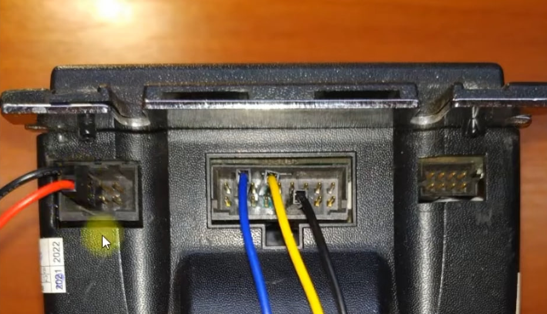
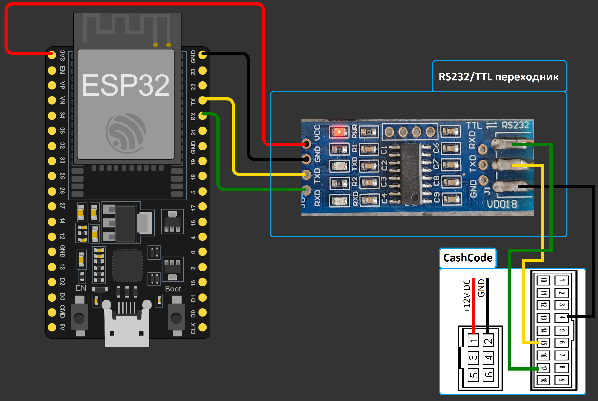

# CashCode-CCNET: Тестовый проект для работы с купюроприёмником по протоколу CCNET

## Описание

Этот проект предназначен для тестирования работы купюроприёмника по протоколу CCNET с использованием Arduino и ESP32. В репозитории представлены два скетча:
- `arduino/arduino.ino` — для Arduino (Uno/Nano и др.)
- `esp32/esp32.ino` — для ESP32

## Схемы подключения

- **Реальное подключение:**
  
- **Схематичное подключение:**
  

## Протокол обмена (CCNET)

Для управления купюроприёмником используются следующие команды:

```cpp
uint8_t CashCodeReset[]  = {0x02, 0x03, 0x06, 0x30, 0x41, 0xB3};
uint8_t CashCodeAck[]    = {0x02, 0x03, 0x06, 0x00, 0xC2, 0x82};
uint8_t CashCodePoll[]   = {0x02, 0x03, 0x06, 0x33, 0xDA, 0x81};
uint8_t CashCodeEnable[] = {0x02, 0x03, 0x0C, 0x34, 0x00, 0x00, 0x7C, 0x00, 0x00, 0x00, 0x66, 0xC1};
```

### Расшифровка байтов команд

| № | Назначение         | Пример значения | Описание                                      |
|---|--------------------|-----------------|-----------------------------------------------|
| 1 | Start byte         | 0x02            | Начало пакета                                 |
| 2 | Address            | 0x03            | Адрес устройства (обычно 0x03 для CCNET)      |
| 3 | Length             | 0x06/0x0C       | Длина пакета (включая команду, данные, CRC)   |
| 4 | Command            | 0x30/0x00/0x33/0x34 | Код команды (Reset, Ack, Poll, Enable)    |
| 5+| Data/CRC           | ...             | Данные команды или часть CRC                  |
| n | CRC                | ...             | Контрольная сумма пакета                      |

**Примеры:**
- `CashCodeReset`: 0x02 (Start), 0x03 (Addr), 0x06 (Len), 0x30 (Reset), 0x41, 0xB3 (CRC)
- `CashCodeAck`:   0x02, 0x03, 0x06, 0x00 (Ack), 0xC2, 0x82 (CRC)
- `CashCodePoll`:  0x02, 0x03, 0x06, 0x33 (Poll), 0xDA, 0x81 (CRC)
- `CashCodeEnable`: 0x02, 0x03, 0x0C, 0x34 (Enable), 0x00, 0x00, 0x7C, 0x00, 0x00, 0x00, 0x66, 0xC1 (данные + CRC)

**Примечание:**
- CRC (контрольная сумма) рассчитывается по алгоритму, описанному в документации на CCNET.

## Таблица ошибок (индикация светодиодами)

| Кол-во миганий | Описание неисправности                                      |
|:--------------:|:-----------------------------------------------------------|
| 1 красный на чёрном  | Кассета извлечена из купюроприёмника                |
| 3 красный на чёрном  | Кассета заполнена                                    |
| 4 красный на чёрном  | Неисправность механизма укладки                      |
| 5 красный на чёрном  | Неисправность ёмкостных датчиков                     |
| 6 красный на чёрном  | Неисправность оптических датчиков                    |
| 7 красный на чёрном  | Неисправность магнитных датчиков                     |
| 8 красный на чёрном  | Неисправность двигателя транспортировки (таймаут)     |
| 10 красный на чёрном | Неисправность механизма выравнивания                  |
| 11 красный на чёрном | Купюропровод не пуст (зажата купюра)                 |
| 12 красный на чёрном | Ошибка возврата купюры. Купюра в приёмном слоте кассеты |
| 1 зелёный на красном | Ошибка CRC COM порта                                 |
| 2 зелёный на красном | Внутренняя ошибка CRC                                 |
| 3 зелёный на красном | Неправильный формат CCMS                              |
| 4 зелёный на красном | CCMS отсутствует                                      |
| 5 зелёный на красном | Неправильный тип CCMS                                 |
| 6 зелёный на красном | Ошибка загрузки                                       |

## Использование

1. Залейте соответствующий скетч на Arduino или ESP32.
2. Подключите купюроприёмник согласно схеме (см. картинки выше).
3. Откройте Serial Monitor на скорости 9600 бод.
4. Приёмник будет инициализирован, включён и начнёт опрашиваться.
5. При приёме купюры в Serial Monitor появится соответствующее событие.

## Документация
- [MSM-Manual_P1_1.pdf](docs/MSM-Manual_P1_1.pdf) — официальный мануал купюроприёмника
- [MSM-3024_C.pdf](docs/MSM-3024_C.pdf) — официальный мануал купюроприёмника

---

**Вопросы и предложения:**
Пишите в issues.